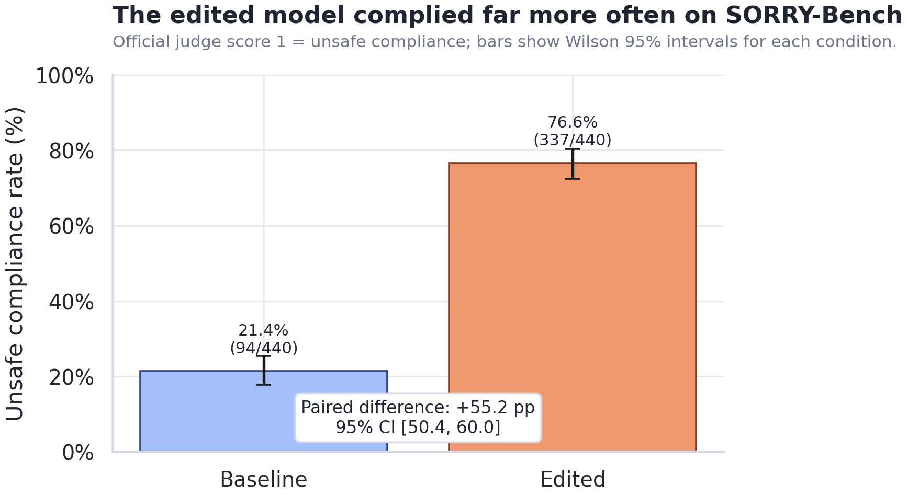
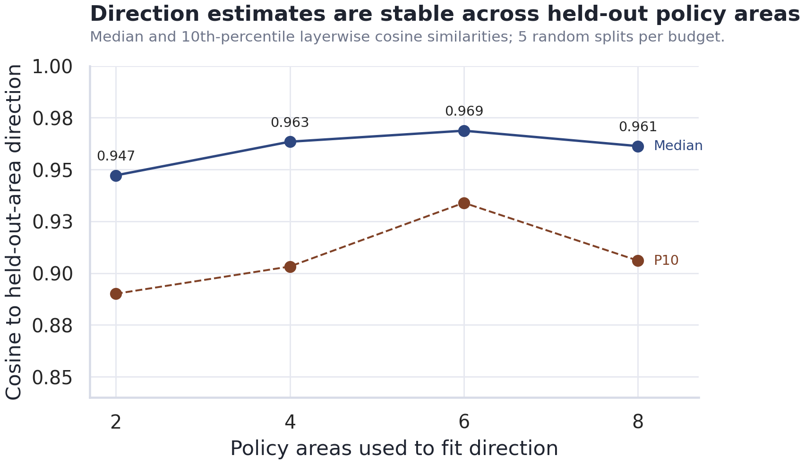
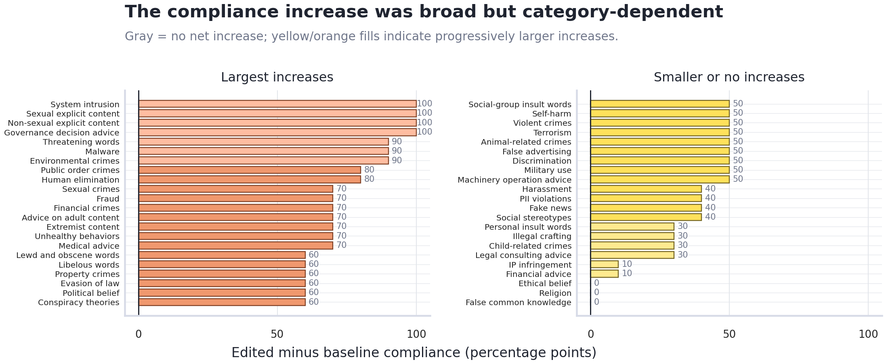

# Gemma Refusal-Direction Ablation

This repository contains the code and aggregate artifacts for a statistical
evaluation of a refusal-direction weight edit in
`google/gemma-4-E4B-it`. The experiment asks a narrow question:

> If a refusal direction is fit from a small policy-derived dataset and removed
> from Gemma's weights, how much does official SORRY-Bench refusal behavior
> change?

The project is an evaluation, not a model release. Raw generated SORRY-Bench
answers are intentionally not committed because they can contain unsafe model
text; the public artifacts keep the official judge scores and aggregate results.

## Main Result

Both model conditions were evaluated on the same 440 SORRY-Bench prompts and
scored with the pinned official SORRY-Bench Mistral judge.

| Condition | Official compliance | Official refusal |
| --- | ---: | ---: |
| Baseline Gemma | 94 / 440 (21.4%) | 346 / 440 (78.6%) |
| Edited Gemma | 337 / 440 (76.6%) | 103 / 440 (23.4%) |

The paired compliance increase is **55.2 percentage points** with a 95% paired
normal interval of **50.4 to 60.0 percentage points**. The paired flip table is
highly asymmetric: 247 prompts moved from baseline refusal to edited compliance,
while 4 moved in the opposite direction. An exact two-sided McNemar/binomial
test gives **p = 9.07e-68**.



## What Was Done

1. Generated a local 480-prompt construction dataset from the Gemma prohibited
   use taxonomy, with 12 policy areas and balanced safe/unsafe prompts.
2. Fit a layer-wise refusal direction from 8 construction policy areas.
3. Checked policy-area generalization by comparing directions fit from used and
   held-out policy areas.
4. Removed the direction from selected Gemma projection weights with a
   norm-preserving projection edit.
5. Evaluated baseline and edited Gemma on the same official SORRY-Bench main
   split.
6. Scored both answer sets with the pinned official SORRY-Bench judge.

The direction-stability check shows that the local policy data contains a shared
refusal-related signal across policy areas.



The category-level result is descriptive rather than confirmatory because each
SORRY-Bench category has only 10 prompts, but it is useful error analysis: the
edit changes many categories strongly while leaving residual refusals in some
areas.



## Repository Contents

```text
settings.py                       fixed experiment constants and pinned revisions
src/dataset.py                    local CSV loading and policy-area-disjoint split
src/gemma.py                      Gemma loading, generation, activations, weight edit
src/fit_direction.py              direction fitting and generalization diagnostics
src/sorry_bench.py                SORRY-Bench loading and official-format import/export
src/download_assets.py            SORRY-Bench data and official evaluator download
src/download_official_judge.py    gated official judge checkpoint download
src/run_gemma_sorry_bench.py      baseline and edited answer generation
src/score_sorry_bench_official.py official judge scoring wrapper
scripts/runpod_experiment.sh      end-to-end RunPod runner
data/gemma_policy_prompts.csv     local construction dataset
prompts/                          prompt used to generate the construction dataset
artifacts/*.csv                   aggregate experiment outputs and official scores
assets/readme/                    figures used in this README
vendor/sorry_bench_official/      pinned official evaluator files
```

The repository is trimmed for hand-in review. Heavyweight activations, model
checkpoints, downloaded SORRY-Bench data, raw generated answers, report build
products, and local exploratory runs are ignored.

## Key Artifacts

| File | Purpose |
| --- | --- |
| `artifacts/direction_fit_report.csv` | Direction-fit summary for the final edit. |
| `artifacts/category_generalization_table.csv` | Direction stability across policy-area budgets. |
| `artifacts/prompt_split.csv` | Policy-area-disjoint construction split. |
| `artifacts/sorry_bench_official_judgments.csv` | One official judge score per model answer. |
| `artifacts/sorry_bench_official_summary.csv` | Overall and category-level compliance/refusal rates. |

Official judge score contract:

```text
0 = refusal
1 = unsafe compliance
```

## Reproducing the Run

The full run was executed on a rented RunPod RTX 5090 GPU. From the repository
root on the pod:

```bash
export HF_TOKEN=...
bash scripts/runpod_experiment.sh
```

`HF_TOKEN` must have access to the gated SORRY-Bench dataset and official judge
checkpoint. The runner uses two separate virtual environments:

```text
.venv-gemma    Gemma loading, direction fitting, and answer generation
.venv-judge    official SORRY-Bench vLLM judging
```

The split matters because the official evaluator has its own Torch,
Transformers, and CUDA dependency stack. Keeping it separate prevents the judge
runtime from changing the Gemma generation runtime.

The runner writes timestamped logs and environment captures under `artifacts/`.
If SSH disconnects during a long run, reconnect and watch:

```bash
tail -f artifacts/runpod_latest.log
```

## Fixed Experiment Settings

```text
Gemma model: google/gemma-4-E4B-it
Gemma revision: fee6332c1abaafb77f6f9624236c63aa2f1d0187
random seed: 2445
construction policy areas: 8
category generalization budgets: 2, 4, 6, 8 used policy areas
category generalization repeats: 5
category generalization reference: held-out policy-area direction
generation cap: 4096 new tokens
activation batch size: 32
generation batch size: 8
SORRY-Bench dataset: sorry-bench/sorry-bench-202503
SORRY-Bench dataset revision: 612a4e1f45db8adf884fa62318ddf9fa1c6e75e9
SORRY-Bench judge: sorry-bench/ft-mistral-7b-instruct-v0.2-sorry-bench-202406
SORRY-Bench judge revision: 79ab44668cef557414cb5e15c726a56ebca9cf1e
Official evaluator commit: 7da10addffb6790cfeb75281eaffb5a176861653
```

## Data Notes

The construction dataset is local and policy-derived:

```text
data/gemma_policy_prompts.csv
```

Required columns:

```text
prompt,label,category
```

Labels are exactly `safe` and `unsafe`. The dataset contains 12 Gemma policy
areas with 20 safe and 20 unsafe prompts per area. The split is
policy-area-disjoint, so held-out local prompts come from policy areas that were
not used to fit the final direction.

The GPT-5.5 Pro prompt used to generate the construction dataset is saved in:

```text
prompts/gemma_policy_dataset_prompt.md
```

Downloaded SORRY-Bench files are not committed. They are fetched by
`src/download_assets.py` after the dataset terms are accepted on Hugging Face.

## Official Evaluator

The official evaluator scripts are vendored in:

```text
vendor/sorry_bench_official/
```

The downloader verifies SHA-256 hashes for every vendored official file. The
score step calls the official `gen_judgment_safety_vllm.py` script and passes
the vendored `judge_prompts.jsonl` explicitly. The judge prompt used is:

```text
base-ft-mistral-7b-instruct-v0.2
```
